<div align="center">


# 📱 Cebian (Sidebar)

**All-in-One Android Edge Gesture & Productivity Tool**  
*Edge Panels · Floating Ball OCR & Image Search · Shake / Desk-Flip / BackTap Gestures · Notification & OTP Manager · Floating Pointer · App Freezer · Freeform Window*

**English** | [简体中文](README.md)

[](https://github.com/qpst4/cebian/releases)
[](LICENSE)
[](https://developer.android.com)
[](https://kotlinlang.org)
[](https://developer.android.com/build)
[](https://gradle.org)
[](https://developer.android.com/jetpack/compose)
[](https://developer.android.com)
[](https://developer.android.com)

<br />

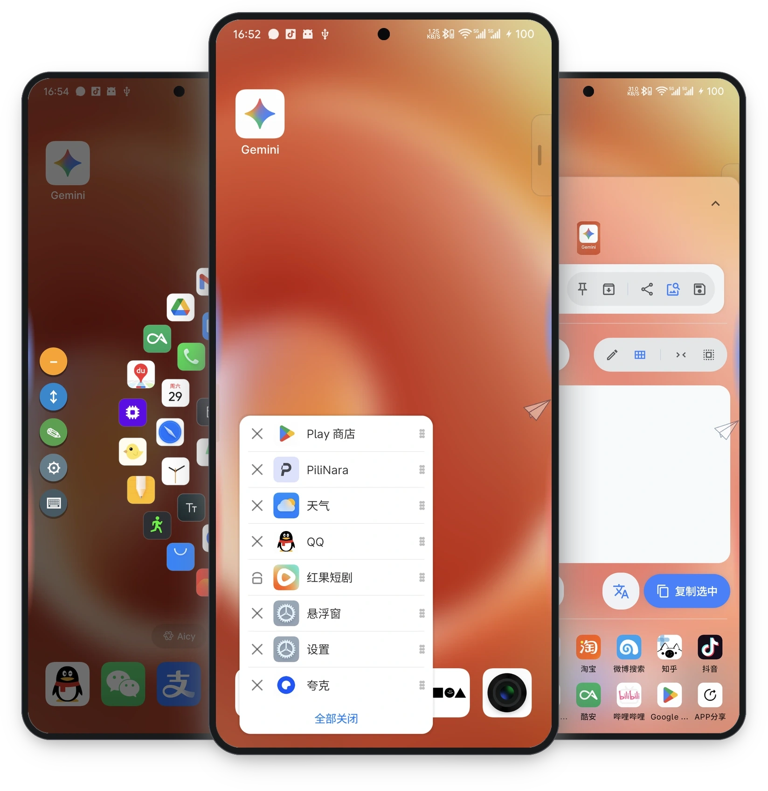

</div>

---

**Cebian** is a system-level gesture and productivity tool for Android built on Accessibility Services, Shizuku, and optional LSPosed integration. Easily trigger 50+ system actions via screen-edge swipes, multi-functional floating ball, device shaking, or back-tap gestures; deeply integrates local multi-engine OCR, word segmentation, and reverse image search aggregation, offering high-efficiency overlay launcher panels, app freezer, OTP verification code extraction, notification management, freeform windows, and floating pointer controls on top of any app.

- **Package Name:** `com.slideindex.app`
- **Current Version:** 1.9.9.8 (versionCode 41)
- **Requirements:** Android 12+ (API 31+)
- **License:** [AGPL-3.0 License](LICENSE)

---

## 📥 Download & Installation

<div align="center">

[](https://github.com/qpst4/cebian/releases/latest)
[](https://github.com/qpst4/cebian/releases/latest)

</div>

| Variant | Scenario | Description |
| :--- | :--- | :--- |
| **Full Package** (`cebian-*-full.apk`) | **Recommended for new users** | Out-of-the-box experience with built-in offline OCR, Jieba segmentation, and offline translation native engines |
| **Lite Package** (`cebian-*-lite.apk`) | Compact size / on-demand updates | Retains core gestures and fundamental features with smaller package size; download extension engines on demand |

> [!TIP]
> Both packages share the same `applicationId` (`com.slideindex.app`), allowing direct overwriting installation without losing configurations.

---

## 🌟 Core Features

The app features four main navigation tabs: 🏠 **Home** · 📳 **Motion** · 🔔 **Notification** · 🧩 **Extensions**.

### 🏠 Home — Edge Gestures, Floating Ball & Customization

#### 1. Edge Gestures
- **Triggers & Aesthetics**: Highly responsive left/right/top/bottom edge triggers, supporting bubble, capsule, wave animations, and haptic feedback.
- **Custom Layout & Landscape Triggers**: Freely adjust trigger position, height, thickness, angle, and segments; supports **dedicated landscape trigger handles** for gaming and media viewing.
- **Smart Anti-Mistouch**: Auto-hide in landscape/lock screen/home screen, with per-app exclusion lists and foreground switching blacklists.
- **Corner Radial Menu**: Swipe from bottom-left or bottom-right corners to summon a radial menu with real-time Gaussian blur and action grouping.
- **OEM Freeform Integration**: Deeply adapts to native Android Freeform, Xiaomi MIUI/HyperOS Small Window, and Meizu Flyme Small Window.

#### 2. 50+ Configurable Gesture Actions

| Category | Actions Supported |
| :--- | :--- |
| **System Navigation** | Back, Home, Recents, Previous App, Lock Screen, Power Menu, Split Screen |
| **Screenshot & Visual** | Fullscreen Screenshot, Region Screenshot, Screenshot OCR, Region OCR, Screen Recorder, Flashlight |
| **OCR & Image Search** | Floating Ball OCR, Reverse Image Search, Live Screen Translation, Universal Screen Copy, Pin Screenshot, QR Code Scanner |
| **Panels & Launchers** | Quick Launcher, App Index, Circle Launcher (FV Style), Honeycomb Launcher, Holographic Launcher, Task Switcher (OHO Style), App Freezer, Expand Panel (Volume/Brightness), Widget Overlay |
| **Media & Controls** | Previous/Next Track, Play/Pause, Volume Adjust, Brightness Adjust, Switch IME |
| **Tools & History** | Floating Pointer, Clipboard History Panel, Quick Tools Panel (OHO Style), Pause Overlay, Pause Gestures |
| **Advanced & Extensions** | Run Shell Commands (Shizuku / Root), Launch Activity / Shortcut, Direct App Launch, Alarm Reminder in N min, Re-freeze Apps |

#### 3. 🔮 Floating Ball (OCR, Image Search & Gestures)
*Operates independently from the Floating Pointer, combining joystick navigation with screen OCR pointers.*

- **Accessibility & Offline Multi-Engine OCR**: Extracts text via accessibility nodes first, seamlessly falling back to local offline OCR (**ML Kit / Tesseract / PaddleOCR ONNX**).
- **Text Selection Panel**: One-click search, translate, segmentation (CppJieba), select all, remove spaces, and copy; supports region clipping and shared image OCR history.
- **Search Aggregation**: Customizable search engines, grid sorting, search history, prefix aliases, and deep links; supports importing from GestureEVO / SearchEVO.
- **Reverse Image Search**: Summon multi-engine reverse search (Google, Yandex, TinEye, SauceNAO, IQDB, 3D-IQDB, ASCII2D, trace.moe, AnimeTrace, Copyseeker) with built-in WebView preview.
- **Pin to Screen**: Pin screenshots or text cards as top-level floating windows with pinch-to-zoom and drag support.
- **Appearance & Tuning**: Custom themes, images, GIFs, and slideshows; adjustable pointer sensitivity and OCR tolerance.

#### 4. Theme & Appearance
- **Miuix Design System**: Comprehensive adoption of Miuix UI (HyperOS style) with collapsible TopAppBar, virtualized grouped cards, overscroll damping, and haptic feedback.
- **Material You Dynamic Coloring**: Automatically extracts wallpaper colors via MaterialKolor on Android 12+, generating 9 palette styles injected into MiuixTheme.
- **Blur & Performance**: Bottom navigation and floating overlays support Gaussian blur and progressive blur; can be disabled to completely eliminate scroll sampling overhead.

---

### 📳 Motion & Device Gestures — Shake, Flip & Back-Tap

- **6-Direction Shake Recognition**: Distinguishes left/right flip, forward/backward flip, and quick side shakes; supports per-app custom actions and sensitivities.
- **Desk-Flip Mute**: Place face-down on a flat surface while screen is on to trigger lock screen and silent mode.
- **Back-Tap Gestures (BackTap)**: Accelerometer-based back-cover double-tap recognition supporting 50+ actions, screen on/off/always trigger policies, sensitivity tuning, and charging guard.
- **Scenario Rules**: Screen on/locked activation policies, app blacklists/whitelists, independent sensitivity thresholds, and vibration feedback.

---

### 🔔 Notification — Reminders, History & OTP

- **Multi-Style Reminders**: Intercepts notifications with Dynamic Island cards, heads-up popups, side bubbles, or screen danmaku; supports "Open Latest Message on Unlock" (with whitelist and confirm policies).
- **Notification History & Filtering**: Categorizes active, history, and hidden notifications with multi-dimensional regex and keyword archiving.
- **OTP Verification Center**: Automatically detects verification codes in SMS and app notifications with regex extraction, clipboard auto-copy, and auto-fill; optional LSPosed module for system-level SMS injection.

---

### 🧩 Extensions — Utility Tools & Backup

| Module | Navigation Entry | Core Capabilities |
| :--- | :--- | :--- |
| **App Index** | Extensions → App Index | Alphabetical Pinyin rail app drawer with adjustable columns and transparency |
| **Quick Launcher** | Extensions → Quick Launcher | Grid launcher supporting multi-panel switching, pagination, folder grouping, and shortcut library |
| **Circle Launcher** | Gesture Action "Circle Launcher" | FV-style concentric circle layout with customizable tiers, spacing, shapes, and slots |
| **Honeycomb Launcher** | Extensions → Honeycomb Launcher | Hexagonal honeycomb grid layout with swipe-out direct launching |
| **Holographic Launcher** | Extensions → Holographic Launcher | Fullscreen 3D holographic sphere launcher; drag to rotate and click to open |
| **Task Switcher** | Gesture Action "Task Switcher" | OHO-style vertical running tasks panel with swipe-to-switch, kill, clear all, and freeform launch |
| **Quick Tools Panel** | Gesture Action "Quick Tools Panel" | OHO-style quick settings panel aggregating system toggles, actions, and shortcuts |
| **App Freezer** | Extensions → App Freezer | Batch freeze and unfreeze background apps via Shizuku / Root with quick re-freeze gesture |
| **Search Panel** | Extensions → Search Panel | Unified search for apps, contacts, files, system settings, web queries, and reverse image search |
| **Activity Shortcuts** | Extensions → Activity Shortcuts | Hidden system settings, non-exported activity launcher, App Shortcuts, and URI deep links |
| **Shell Commands** | Extensions → Shell Commands | Command panels, template variable substitution, and custom icons via Shizuku / Root |
| **Widget Panel** | Extensions → Widget Panel | Floating desktop widget host with adjustable blur background and multi-selection |
| **Floating Pointer** | Extensions → Floating Pointer | Virtual joystick-controlled ring pointer with hover selection, radial actions, and gesture macro replay |
| **Clipboard History** | Gesture Action "Clipboard Panel" | Rich clipboard history with search, edge floating window, and Shizuku background listener |
| **Settings Backup** | Extensions → Settings Backup | Export and import all configurations and assets as encrypted ZIP files |

#### 📸 Key Interfaces & Interaction Preview

<div align="center">

| Corner Radial Menu | Circle Launcher (FV Style) | Quick Launcher (Grid) |
| :---: | :---: | :---: |
| 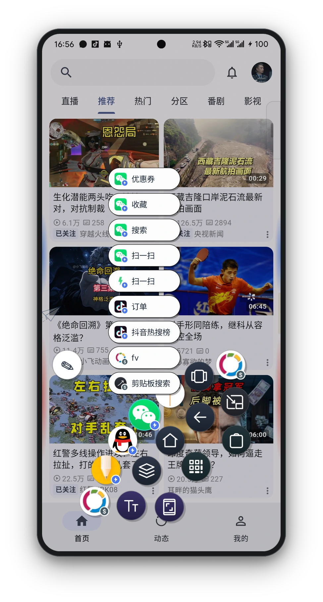 | 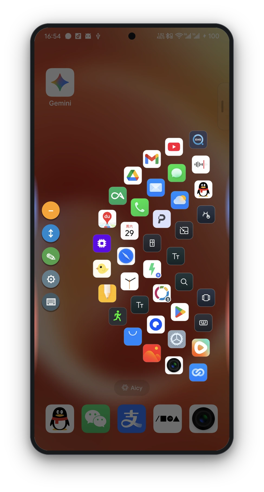 | 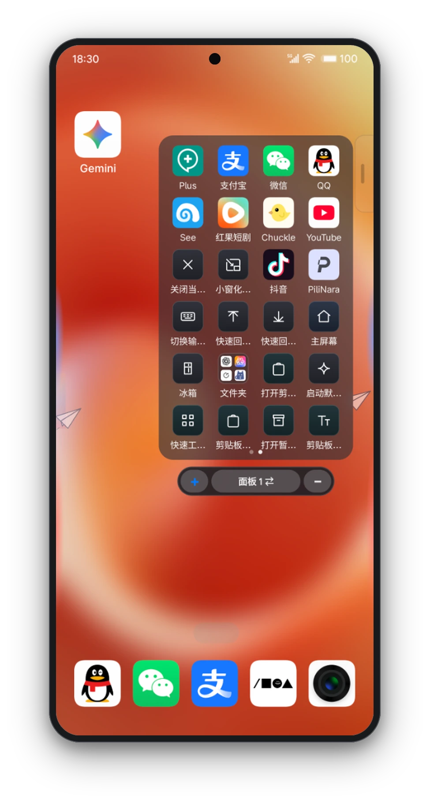 |
| **Floating Pointer (Joystick)** | **Shell Command Panel (Shizuku)** | **Clipboard History / Stash** |
| 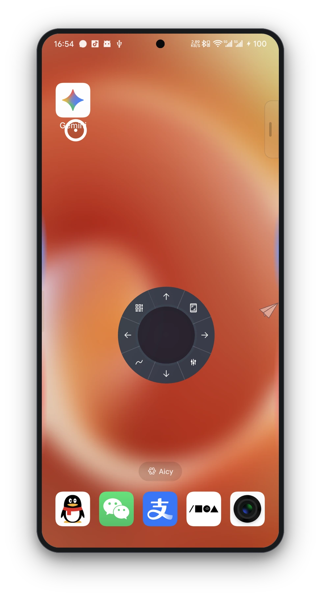 | 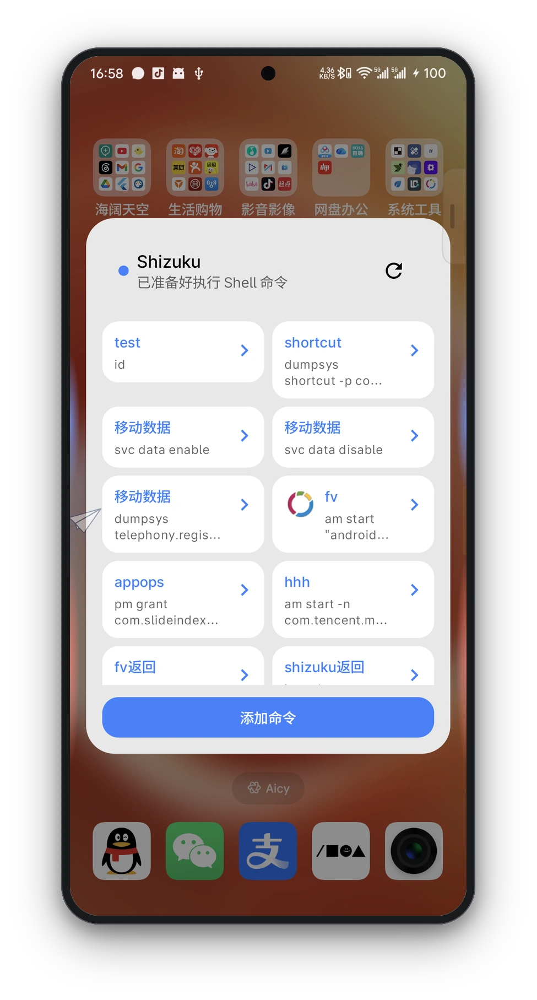 | 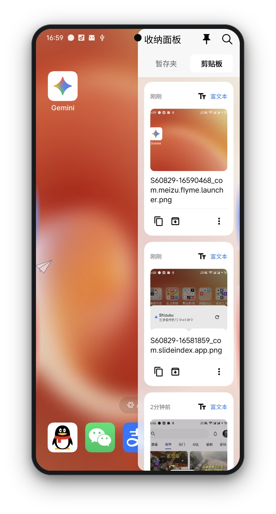 |
| **App Index (Pinyin Rail)** | **Widget Floating Panel** | **Pin Screenshot Window** |
| 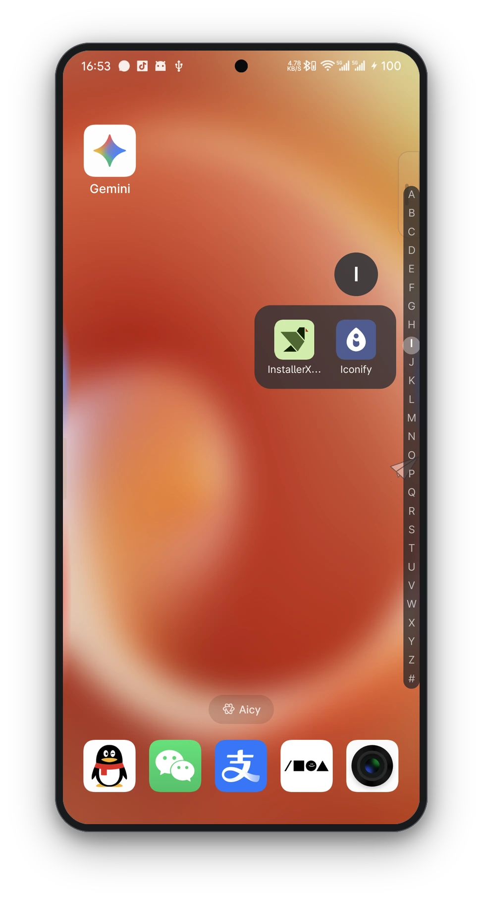 | 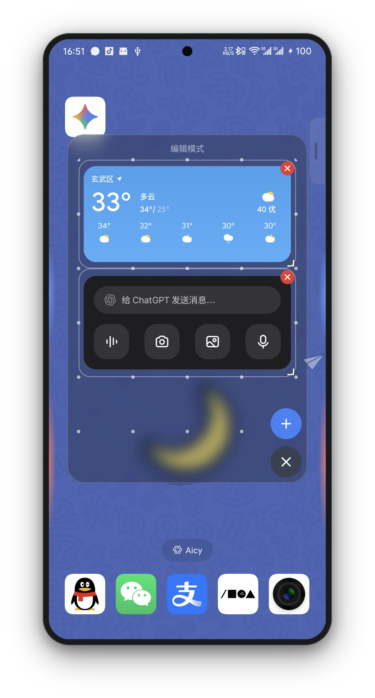 | 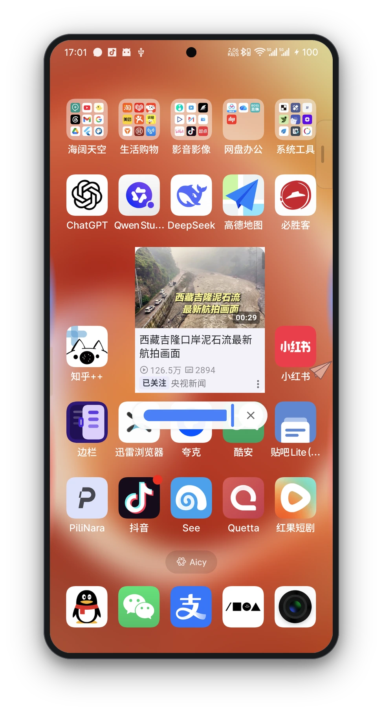 |

</div>

---

## 🛠️ Tech Stack

| Layer | Core Technologies / Components |
| :--- | :--- |
| **Languages** | Kotlin 2.4.0 + C++17 (NDK / CMake) |
| **UI Framework** | Miuix UI (KMP 0.9.4 / HyperOS style) + Jetpack Compose (BOM 2026.07.01) |
| **Color & Visuals** | MaterialKolor 5.0.0 (Dynamic Wallpaper Colors) + Haze 1.7.2 (Gaussian Blur) |
| **Architecture & DI** | MVVM + UDF (Unidirectional Data Flow) + Dagger Hilt 2.60.1 |
| **Async & State** | Kotlin Coroutines 1.11.0 + StateFlow / SharedFlow + DataStore Preferences 1.2.1 |
| **OCR & AI** | ML Kit Text Recognition 16.0.1 + Tesseract4Android 4.9.0 + PaddleOCR (ONNX Runtime 1.28.0 + OpenCV 4.12.0) |
| **NLP & Tokenization** | CppJieba (JNI Native Tokenizer) + ML Kit Translate / Language ID |
| **Privileged Access** | Shizuku API 13.1.5 + LibSuperuser 1.1.1 + HiddenApiBypass 6.1 + LibXposed API 102.0.0 |
| **Network & Parsing** | OkHttp 5.4.0 + ZXing Core 3.5.4 + kotlinx.serialization 1.11.0 + Markdown Renderer M3 |

---

## 📐 Architecture

The app adopts a **Multi-Module layered architecture** following **MVVM + UDF** patterns:

```
                              ┌─────────────────────────────┐
                              │          :app (Root)        │
                              └──────────────┬──────────────┘
                                             │
                      ┌──────────────────────┼──────────────────────┐
                      ▼                      ▼                      ▼
           ┌──────────────────────┐┌──────────────────────┐┌──────────────────────┐
           │   :feature:settings  ││     :feature:otp     ││   :feature:shake     │
           │   :feature:apps      ││ :feature:notification││   :feature:message   │
           └──────────┬───────────┘└──────────┬───────────┘└──────────┬───────────┘
                      │                       │                       │
                      └──────────────────────┼───────────────────────┘
                                             ▼
           ┌──────────────────────────────────────────────────────────────────────┐
           │ :core:gesture       :core:ocr          :core:translate  :core:autofill│
           │ :core:overlay-layout:core:native-engine:core:monitoring :core:common │
           └──────────────────────────────────┬───────────────────────────────────┘
                                             ▼
                                  ┌───────────────────────┐
                                  │   :vendor:ppocr-sdk   │
                                  └───────────────────────┘
```

1. **Service Coordination & Overlay Rendering**: `SlideIndexAccessibilityService` intercepts global gestures and dispatches system events, while overlays are managed by `OverlayLayout` and independent WindowManagers.
2. **Dynamic Engine Loading**: OCR, translation, and segmentation engines support both Full and Lite packaging modes; native `.so` libraries and models can be extracted at runtime.
3. **Privileged Pipelines**: Shizuku IPC (rootless privilege), Root fallback executor (LibSu), and LSPosed module collaborate to provide seamless background clipboard monitoring and process lifecycle control.

---

## 📂 Project Structure

```
.
├── app/                                 # Host Application: DI assembly, JNI C++ bridge, and main UI
│   └── src/main/
│       ├── cpp/                         # C++17 JNI Sources (CppJieba bridge)
│       └── java/com/slideindex/app/
│           ├── activity/                # Top-level Activities & transparent interaction layers
│           ├── backtap/                 # Back-tap gestures
│           ├── clipboard/               # Clipboard history & Shizuku background monitor
│           ├── gesture/                 # Core gesture service & overlay trigger bars
│           ├── overlay/                 # System overlay window managers
│           ├── search/                  # Text & reverse image search aggregator
│           ├── shell/                   # Shell command executor
│           ├── ui/                      # Compose UI, Miuix themes, and dynamic colors
│           └── xposed/                  # LSPosed module entry & hooks
├── core/                                # Core modules & engines
│   ├── autofill/                        # OTP autofill framework
│   ├── common/                          # Extensions, shared models, and utilities
│   ├── gesture/                         # Gesture recognition algorithms & event bus
│   ├── monitoring/                      # Performance tracing & memory monitoring
│   ├── native-engine/                   # Offline native engine distribution & asset extraction
│   ├── notification/                    # Notification interception & processing
│   ├── ocr/                             # Multi-engine OCR dispatcher (ML Kit / Tesseract / ONNX)
│   ├── overlay-layout/                  # Overlay layout rendering core
│   └── translate/                       # Multi-language translation & language detection
├── feature/                             # Business feature modules
│   ├── apps/                            # App scanner, icon caching, and launchers
│   ├── message/                         # Heads-up notification & danmaku rendering
│   ├── notification/                    # Notification history & archiving
│   ├── otp/                             # Verification code extraction & statistics
│   ├── settings/                        # Settings, preferences backup, and DataStore
│   └── shake/                           # Sensor shake & desk-flip algorithms
├── vendor/
│   └── ppocr-sdk/                       # PaddleOCR SDK binding & ONNX Runtime
├── gradle/libs.versions.toml             # Dependency catalog
└── RELEASE_NOTES.md                     # Release changelog
```

---

## 🚀 Building & Compilation

### Requirements
- **JDK 21**
- **Android Studio** (Ladybug or newer recommended)
- **Android SDK** (API 37 `compileSdk`) & **NDK 28+**

### Build Commands
```bash
# Clone the repository
git clone https://github.com/qpst4/cebian.git
cd cebian

# Build Full Debug APK (with built-in offline engines)
./gradlew assembleFullDebug

# Build Lite Release APK (compact version)
./gradlew assembleLiteRelease
```

---

## 💬 Community & Feedback

Welcome to join the community discussions and provide feedback or feature requests:

<div align="center">

[](https://github.com/qpst4/cebian/discussions)
[](https://github.com/qpst4/cebian/issues)
[](https://qm.qq.com/q/jHZTMmiZ9K)

</div>

---

## 💖 Sponsor & Support

If you find **Cebian** helpful in your daily workflow, consider buying the developer a cup of coffee ☕! Your generous support is the greatest motivation for ongoing development and OEM adaptations.

<div align="center">
  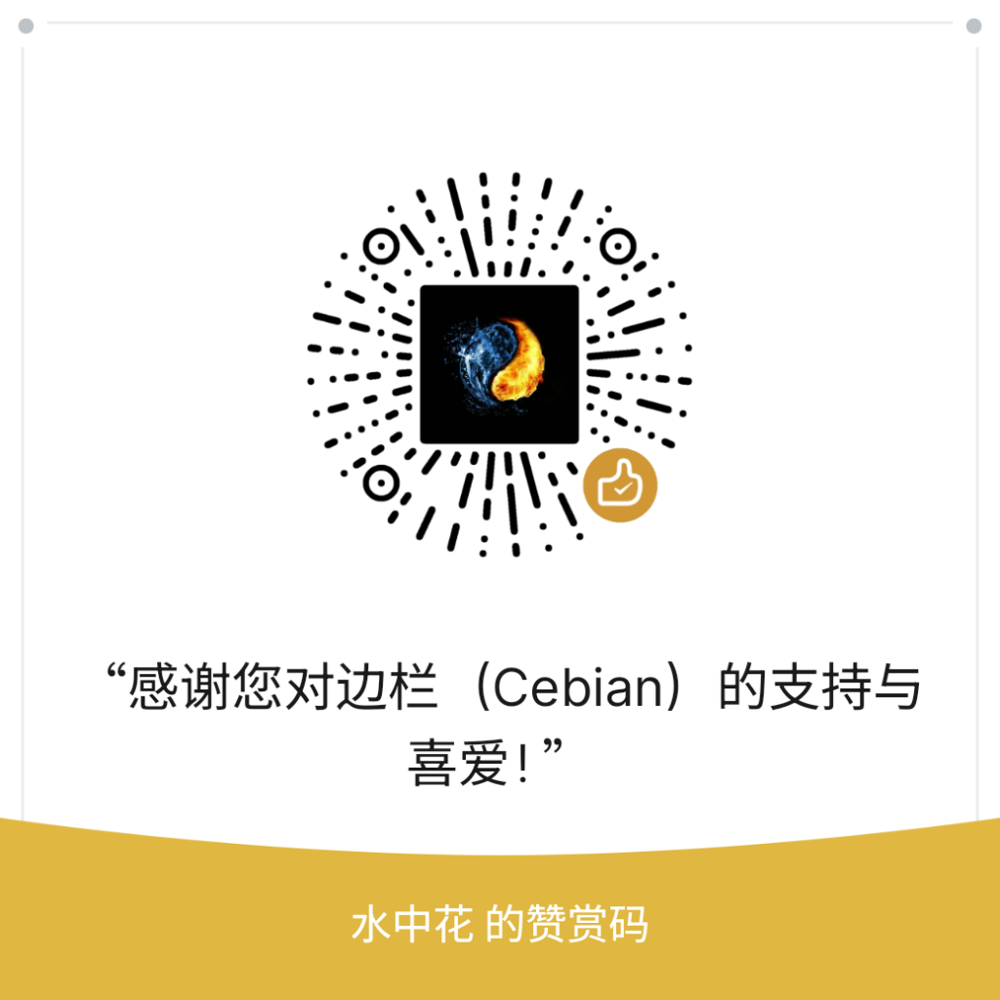
</div>

---

## 📜 License

This project is licensed under the [GNU Affero General Public License v3.0](LICENSE) (AGPLv3).

---

## 🤝 Acknowledgements

Special thanks to the following open-source projects for their architecture, inspiration, and code references (see [THIRD_PARTY_NOTICES.md](THIRD_PARTY_NOTICES.md) for details):

- [SideGesture](https://github.com/aaronzzx/SideGesture) — Edge gesture and overlay architecture reference
- [EdgeGesture](https://github.com/evilgodxu/EdgeGesture) — Expand panel, alarm reminder, screen translation, universal copy, and back-tap gesture reference
- [EdgeX](https://github.com/oxohang/EdgeX) & [FanFreeform](https://github.com/oxohang/FanFreeform) — Honeycomb launcher and App Freezer architecture reference
- [ClipboardListener](https://github.com/aa2013/ClipboardListener) & [ClipShare](https://github.com/aa2013/ClipShare) — Android 10+ background clipboard listening architecture
- [Root Activity Launcher](https://github.com/zacharee/RootActivityLauncher) — Non-exported activity launching scheme
- [Circle To Search](https://github.com/AKS-Labs/CircleToSearch) — Multi-engine reverse image search strategy
- [Nova Text](https://github.com/CashewTeam/BigBang_NovaText) — Floating ball OCR and word selection interaction
- [XposedSmsCode](https://github.com/tianma8023/XposedSmsCode) — OTP SMS Hook and verification code extraction rules
- [Miuix](https://github.com/compose-miuix-ui/miuix) — Elegant Material & Miuix style Compose UI component library

---

## 📝 Changelog

For complete release history, see [RELEASE_NOTES.md](RELEASE_NOTES.md) and [CHANGELOG.md](CHANGELOG.md).