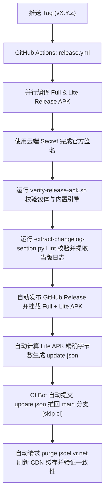

# 发版流程（Release Checklist）

> **给 AI 工具与维护者：** 本仓库采用 **Tag 驱动的全自动云端闭环流水线（Tag-Driven Release CI）**。发版时只需**更新日志、升版本号并推送 Tag**，云端 GitHub Actions 会自动完成构建、签名、校验、发布 GitHub Release、回填 `update.json` 与 CDN 缓存刷新。

远程仓库：`qpst4/cebian`

---

## 产物说明

| 产物 | 文件名 | 用途 |
|------|--------|------|
| **Full 胖包** | `cebian-{版本}-full.apk` | GitHub Release；新用户装完即用（内置完整 Native 引擎包） |
| **Lite 轻量包** | `cebian-{版本}-lite.apk` | **应用内更新**默认指向此包（轻量，不含内置引擎） |
| **引擎 zip** | `*-engine-arm64-vN.zip` | **仅引擎变更时**上传；纯 App 发版不必每次附带 |

`applicationId` 始终为 `com.slideindex.app`，full / lite 可互相覆盖安装。

---

## 发版操作（极简 3 步）

### 1. 收集当版完整日志（必须）

**禁止仅盲目拷贝 `CHANGELOG.md` 中现有的 `[Unreleased]` 暂存文字。** 必须通过 `git log` 与文件 Diff 主动审计自上次 Tag 发版以来的所有真实变更：

```bash
# 查出上一个发版 Tag
last_tag=$(git describe --tags --abbrev=0)

# 1. 输出自上次发版以来的所有 Commit 变更
git log ${last_tag}..HEAD --oneline

# 2. 检查新增文件与配置类（防止遗漏全新 Feature/模式）
git diff ${last_tag}..HEAD --name-only --diff-filter=A
```

**审计铁律：** 
- 凡在两次 Release 之间**新增了 ViewModel/Enum/配置类/组件**，代表引入了全新的功能或模式，**100% 必须作为 `Added` 新功能列出**，绝不可仅作为 Bug 修复简写。
- 汇总审计所有 Commit 与新增文件后，归纳整理出当版完整的 `Added` / `Changed` / `Fixed` 清单，写入 `CHANGELOG.md` 的 `## [{版本号}] - YYYY-MM-DD` 章节中。

---

### 2. 升版本号

同步修改：
- `app/build.gradle.kts` → `versionCode`、`versionName`
- `README.md` → 顶部版本行（`版本：X.Y.Z（versionCode N）`）

*(注：`update.json` 会由云端 CI 在生成精确 APK 后自动计算并回填，无需本地提前手动修改)*

---

### 3. 提交并推送 Tag

```bash
git add app/build.gradle.kts README.md CHANGELOG.md
git commit -m "{版本号}：{简述} [skip ci]"
git tag -a v{版本号} -m "v{版本号}"
git push origin main
git push origin v{版本号}
```

Commit 备注格式：`1.9.9：边角轮盘手势 [skip ci]`（版本号 + 中文冒号 + 简述 + **`[skip ci]`**）。

发版 commit 会 push 到 `main` 并打 Tag；`[skip ci]` 用于跳过日常 **CI** 工作流中的重复 Release 构建（正式发版由 `release.yml` 在 Tag 推送时执行）。GitHub Actions **不会**自动识别该标记，已在 [`.github/workflows/ci.yml`](.github/workflows/ci.yml) 中配置判断。

---

## 云端自动化流水线（CI 自动完成）

推送 Tag（`v*`）后，[`.github/workflows/release.yml`](.github/workflows/release.yml) 会自动接管并执行以下全套闭环：



---

## 进度与状态检查

如需在终端查看云端发版状态：

```bash
# 查看最新的 Release 工作流进度
gh run list --workflow=release.yml --limit 1

# 实时监听流水线执行状态
gh run watch <run-id> --exit-status

# 发布完成后查看 Release 页面
gh release view v{版本号}
```

---

## 相关文件与脚本

| 文件 | 用途 |
|------|------|
| `.github/workflows/release.yml` | Tag 驱动的全自动云端发版流水线 |
| `.github/workflows/ci.yml` | 日常 Push / PR 的持续集成与 Lint 检查 |
| `update.json` | 应用内检查更新清单（由 CI 全自动生成与维护） |
| `scripts/extract-changelog-section.py` | 跨平台提取并 Lint 当版 CHANGELOG 段落 |
| `scripts/update-release-manifest.py` | 跨平台生成 `update.json` + CDN Purge + 远端校验 |
| `scripts/verify-release-apk.sh` | 校验 Release APK 版本号与 Native 引擎打包完整性 |
